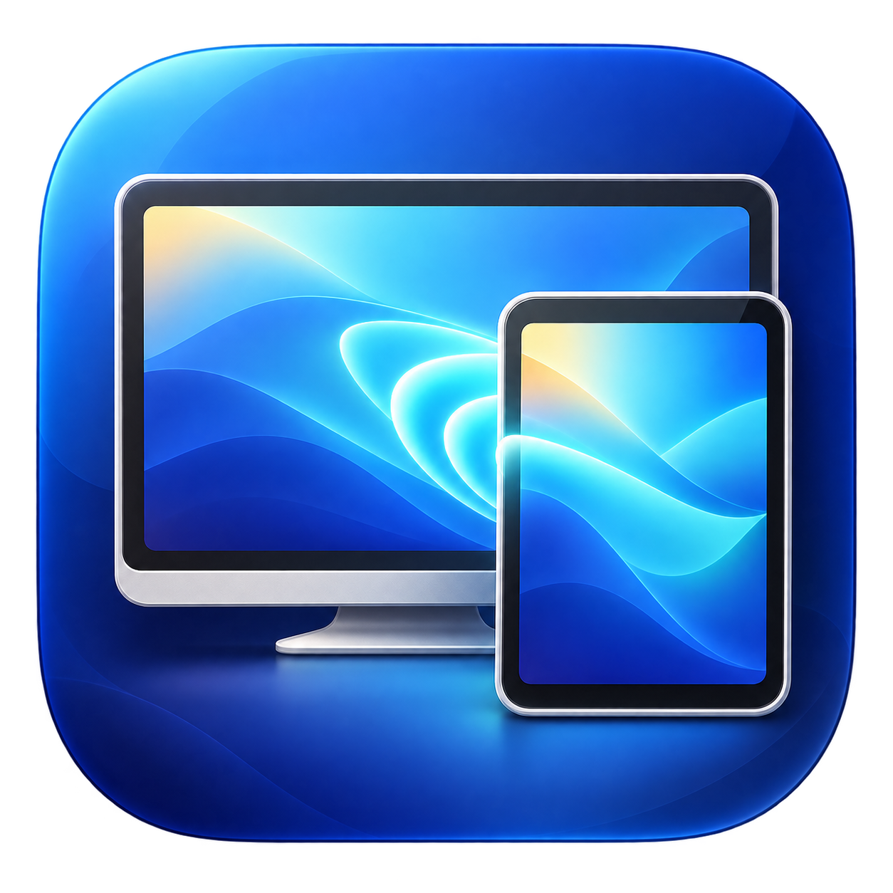

# ClassMirror

<p align="center">
  
</p>

[](https://github.com/Donkey-haw/ClassMirror/actions/workflows/ci.yml)
[](LICENSE)
[](docs/INSTALLATION.md)

ClassMirror는 iPad 또는 iPhone의 기본 **화면 미러링**을 Apple Silicon
Mac의 독립된 창으로 수신하는 경량 AirPlay Receiver입니다. 동일 Apple
계정이나 iOS 앱 설치 없이 같은 로컬 네트워크에서 동작합니다.

```text
iPad / iPhone → AirPlay → ClassMirror 창 → Apple TV / 프로젝터 / OBS
```

> **Alpha 소프트웨어:** 현재 공개 빌드는 기능 검증을 위한 사전
> 공개판입니다. 중요한 수업 전에 사용할 네트워크와 기기로 충분히
> 시험하세요.

## 주요 기능

- iPadOS/iOS 기본 화면 미러링 수신
- PIN 연결 인증
- H.264 하드웨어 디코딩과 Metal 렌더링
- 시스템 오디오 수신과 음소거
- 가로·세로 회전 및 화면 비율 유지
- 시스템 전체 화면, 항상 위, Fit/50/75/100% 크기
- 메뉴바에서 수신기와 세션 제어
- Mac의 Apple TV 송출과 함께 사용하는 로컬 네트워크 모드
- 계정, 클라우드, 분석 SDK, 화면 녹화 없음

## 지원 환경

- Apple Silicon Mac
- macOS 15 이상
- iOS 17 이상 또는 iPadOS 17 이상 권장
- 기본 모드는 Mac과 송신 기기가 통신할 수 있는 동일 로컬 네트워크

Intel Mac과 Windows는 현재 지원하지 않습니다. DRM 보호 영상은 표시되지
않을 수 있습니다. 한 번에 한 대의 송신 기기만 지원합니다.

## 설치

1. [Releases](https://github.com/Donkey-haw/ClassMirror/releases)에서 최신
   `ClassMirror-…-macos-arm64.dmg`를 받습니다.
2. DMG를 열고 `ClassMirror`를 `Applications`로 드래그합니다.
3. ClassMirror를 실행하고 로컬 네트워크 접근을 허용합니다.

현재 Alpha DMG는 Apple Developer ID로 공증되지 않았습니다. macOS가 첫
실행을 막으면 [설치 안내](docs/INSTALLATION.md)의 공식 macOS 절차를
따르세요. Gatekeeper 전체 비활성화는 권장하지 않습니다.

## 1분 사용법

1. Mac에서 ClassMirror를 실행하고 `연결 대기 중`인지 확인합니다.
2. iPad/iPhone에서 제어 센터 → **화면 미러링**을 엽니다.
3. Mac에 표시된 `ClassMirror-XXXX` 이름을 선택합니다.
4. Mac에 표시된 PIN을 iPad/iPhone에 입력합니다.
5. 영상 영역을 더블클릭하거나 `⌘ Enter`를 눌러 전체 화면으로 전환합니다.

Apple TV와 동시에 사용할 때는 ClassMirror 설정 → 연결에서 **Apple TV
동시 사용 (권장)**을 선택하세요. 이 모드는 Mac과 iPad가 같은 LAN에
있어야 합니다. 자세한 사용법은 [사용 설명서](docs/USER_GUIDE.md)를
참고하세요.

## 문서

- [설치](docs/INSTALLATION.md)
- [사용 설명서](docs/USER_GUIDE.md)
- [문제 해결](docs/TROUBLESHOOTING.md)
- [빌드 및 개발](docs/BUILDING.md)
- [아키텍처](docs/ARCHITECTURE.md)
- [시험 기준](docs/TESTING.md)
- [개인정보](PRIVACY.md)
- [보안 정책](SECURITY.md)
- [기여 방법](CONTRIBUTING.md)
- [릴리스 절차](docs/RELEASING.md)
- [변경 내역](CHANGELOG.md)

## 소스에서 빌드

개발 빌드는 Homebrew의 OpenSSL과 libplist를 사용합니다.

```bash
brew install pkg-config openssl@3 libplist
git clone https://github.com/Donkey-haw/ClassMirror.git
cd ClassMirror
swift test
./script/build_and_run.sh
```

Homebrew 런타임 의존성이 없는 배포용 앱은 다음 명령으로 만듭니다.

```bash
./script/build_release.sh
```

자세한 요구사항과 재현 가능한 의존성 빌드는
[빌드 문서](docs/BUILDING.md)에 있습니다.

## 개인정보와 네트워크

ClassMirror는 Apple ID, 계정, 화면, 음성, 사용 기록을 수집하거나 외부
서버로 전송하지 않습니다. 미러링 데이터는 송신 기기와 Mac 사이에서
처리되며 세션 종료 후 저장하지 않습니다. 자세한 내용은
[PRIVACY.md](PRIVACY.md)를 참고하세요.

## 라이선스

ClassMirror는 [GNU GPL version 3](LICENSE)으로 배포됩니다. UxPlay 기반
AirPlay Core와 기타 구성요소의 출처 및 조건은
[THIRD_PARTY_NOTICES.md](THIRD_PARTY_NOTICES.md)에 정리되어 있습니다.

Apple, AirPlay, iPhone, iPad, Mac 및 Apple TV는 Apple Inc.의 상표입니다.
ClassMirror는 Apple이 제작하거나 보증하는 제품이 아닙니다.
